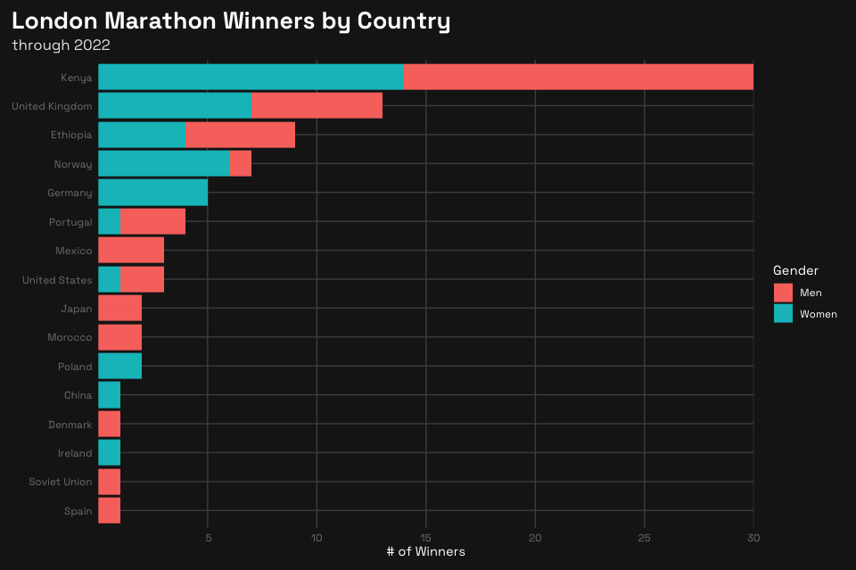

2023-w17
================

``` r
library(tidyverse)
```

    ── Attaching packages ─────────────────────────────────────── tidyverse 1.3.2 ──
    ✔ ggplot2 3.4.0      ✔ purrr   0.3.5 
    ✔ tibble  3.1.8      ✔ dplyr   1.0.10
    ✔ tidyr   1.2.1      ✔ stringr 1.5.0 
    ✔ readr   2.1.3      ✔ forcats 0.5.2 
    ── Conflicts ────────────────────────────────────────── tidyverse_conflicts() ──
    ✖ dplyr::filter() masks stats::filter()
    ✖ dplyr::lag()    masks stats::lag()

``` r
winners <- readr::read_csv('https://raw.githubusercontent.com/rfordatascience/tidytuesday/master/data/2023/2023-04-25/winners.csv')
```

    Rows: 163 Columns: 5
    ── Column specification ────────────────────────────────────────────────────────
    Delimiter: ","
    chr  (3): Category, Athlete, Nationality
    dbl  (1): Year
    time (1): Time

    ℹ Use `spec()` to retrieve the full column specification for this data.
    ℹ Specify the column types or set `show_col_types = FALSE` to quiet this message.

``` r
london_marathon <- readr::read_csv('https://raw.githubusercontent.com/rfordatascience/tidytuesday/master/data/2023/2023-04-25/london_marathon.csv')
```

    Rows: 42 Columns: 8
    ── Column specification ────────────────────────────────────────────────────────
    Delimiter: ","
    chr  (1): Official charity
    dbl  (6): Year, Applicants, Accepted, Starters, Finishers, Raised
    date (1): Date

    ℹ Use `spec()` to retrieve the full column specification for this data.
    ℹ Specify the column types or set `show_col_types = FALSE` to quiet this message.

``` r
winners <- winners %>% 
  filter(Category %in% c("Men", "Women")) %>% 
  mutate(Nationality = as.factor(Nationality))
```

``` r
plot <- ggplot(winners, aes(y = fct_rev(fct_infreq(Nationality)), fill = Category)) +
  geom_bar(
  ) +
  labs(
    title = "London Marathon Winners by Country",
    subtitle = "through 2022",
    x = "# of Winners",
    y = NULL,
    fill = "Gender"
  ) +
  scale_x_discrete(
    breaks = c(5, 10, 15, 20, 25, 30),
    limits = c(5, 10, 15, 20, 25, 30),
    expand = c(0,0)
  ) +
  theme(
    plot.background = element_rect(color = "gray10", fill = "gray10"),
    panel.background = element_rect(color = NULL, fill = "gray10"),
    
    legend.background = element_rect(color = NULL, fill = "gray10"),
    legend.key = element_blank(),
    
    panel.grid = element_line(color = "gray30"),
    axis.text = element_text(color = "gray50",
                               family = "Space Grotesk"),
    axis.ticks = element_blank(),
    axis.title = element_text(color = "white",
                              family = "Space Grotesk"),
    
    legend.title = element_text(color = "white",
                                family = "Space Grotesk"),
    legend.text = element_text(color = "white",
                               family = "Space Grotesk"),
    
    plot.title.position = "plot",
    plot.title = element_text(color = "white",
                              size = 20,
                              family = "Space Grotesk Bold"),
    plot.subtitle = element_text(color = "gray90",
                                 size = 12.5,
                                 family = "Space Grotesk"),
    plot.margin = margin(10, 10, 10, 10)
  )
```

    Warning: Continuous limits supplied to discrete scale.
    ℹ Did you mean `limits = factor(...)` or `scale_*_continuous()`?

``` r
plot
```


